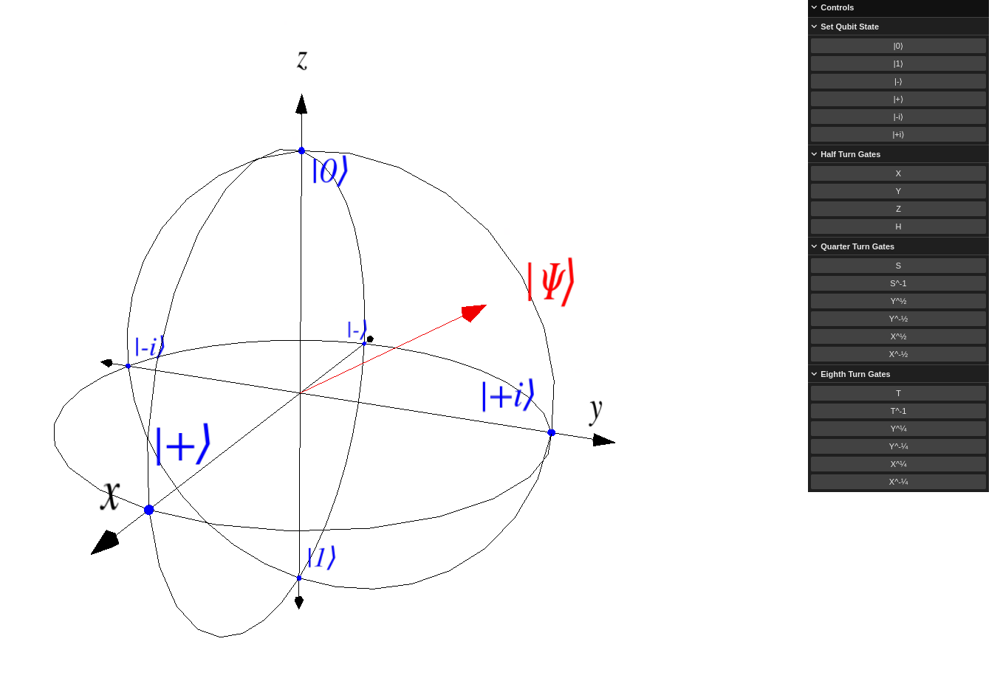

# Interactive Bloch Sphere

An interactive [bloch sphere](https://en.wikipedia.org/wiki/Bloch_sphere) implemented with [Three.js](https://threejs.org/).

## Features
* Setting qubit state to basis states:

$$
\lvert 0 \rangle =
\left\lceil
\begin{matrix}
1 \\
0
\end{matrix}
\right\rceil
$$

$$
\lvert 1 \rangle =
\left\lceil
\begin{matrix}
0 \\
1
\end{matrix}
\right\rceil
$$

$$
\lvert - \rangle =
\frac {1} {\sqrt{2}}
\left\lceil
\begin{matrix}
1 \\
-1
\end{matrix}
\right\rceil 
$$

$$
\lvert + \rangle =
\frac {1} {\sqrt{2}}
\left\lceil
\begin{matrix}
1\\
1
\end{matrix}
\right\rceil
$$

$$
\lvert -i \rangle =
\frac {1} {\sqrt{2}}
\left\lceil
\begin{matrix}
1 \\
-i
\end{matrix}
\right\rceil
$$

$$
\lvert +i \rangle =
\frac {1} {\sqrt{2}}
\left\lceil
\begin{matrix}
1 \\
i
\end{matrix}
\right\rceil
$$

* Applying gates, this includes:
  * Half turn gates:
    * $X$ Gate
    * $Y$ Gate
    * $Z$ Gate
    * $H$ Gate
  * Quater turn gates:
    * $S$ Gate ($\sqrt{Z}$)
    * $S^{-1}$ Gate ($Z^{-\frac 1 2}$)
    * $Y^{\frac 1 2}$ Gate
    * $Y^{-\frac 1 2}$ Gate
    * $X^{\frac 1 2}$ Gate
    * $X^{-\frac 1 2}$ Gate
  * Eighth turn gates:
    * $T$ Gate
    * $T^{-1}$ Gate
    * $Y^{\frac 1 4}$ Gate
    * $Y^{-\frac 1 4}$ Gate
    * $X^{\frac 1 4}$ Gate
    * $X^{-\frac 1 4}$ Gate

These gates can be applied in any order for example $H, T, Y^{-\frac 1 4}$ will result in this state:



## How To Run
1. Have npm installed
2. run `npm install`
3. run `vite serve`

## Use As npm Package
This project is available as an npm package under the name [interactive-blochsphere](https://www.npmjs.com/package/interactive-blochsphere).

### Example Usage
```javascript
import {InteractiveBlochSphere} from "interactive-blochsphere";

new InteractiveBlochSphere(document.getElementById("blochsphere"));
```